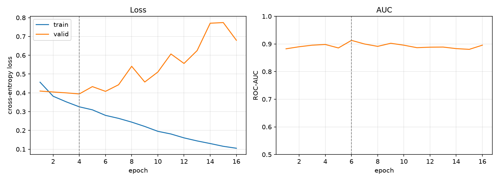

# MURA Wrist Abnormality Detection

Binary classification of wrist radiographs as normal or abnormal, using an
ImageNet-pretrained EfficientNetV2-S. Built and trained from scratch on a single
8 GB laptop GPU.

Metrics are reported at two levels: per image, and per study. MURA's official
protocol is per study, because a radiologist reports on one examination (usually
several views) rather than on a single film.

---

## Data

[MURA v1.1](https://stanfordmlgroup.github.io/competitions/mura/) (Stanford ML
Group), restricted to the `XR_WRIST` subset. The dataset ships with its own
train/validation split, partitioned by patient, and it is used unchanged. No
patient appears in both sets.

| | train | validation |
|---|---:|---:|
| images | 9,752 | 659 |
| studies | 3,460 | 237 |
| positive rate (per study) | 38.3% | 40.9% |
| positive rate (per image) | 40.9% | 44.8% |
| mean images per study | 2.82 | 2.78 |

Labels are stored in the directory name (`study1_positive` / `study1_negative`).
`dataset.py` reads them from the path and checks every one against the official
`*_labeled_studies.csv`: 36,808 images, zero mismatches.

The per-image and per-study positive rates differ because positive studies
contain more images on average. Extra views appear to be taken when something
looks abnormal.

---

## Results

Selected checkpoint (epoch 2 of 12), MURA official validation split, at the
default decision threshold of 0.50:

| | image level | study level |
|---|---:|---:|
| ROC-AUC | 0.9101 | **0.9250** |
| Cohen's κ | 0.6658 | **0.7021** |
| accuracy | 0.8376 | 0.8608 |
| sensitivity | 0.7254 | 0.7216 |
| specificity | 0.9286 | 0.9571 |
| precision | 0.8917 | 0.9211 |
| F1 | 0.8000 | 0.8092 |
| TN / FP / FN / TP | 338 / 26 / 81 / 214 | 134 / 6 / 27 / 70 |
| n | 659 images | 237 studies |

Study-level scores are higher on every metric. Averaging the per-image
probabilities within a study removes some of the per-image noise. It also matches
the question to the labels: a label of 1 means the examination is abnormal, not
that this particular view shows the abnormality.

The 0.50 threshold above is a default rather than a choice, and it is a poor one
for this model. See the next section.

---

## Choosing an operating point

Threshold sweep over the study-level predictions (97 abnormal, 140 normal
studies). Full sweep in `threshold_sweep.csv`.

| threshold | missed (FN) | false alarms (FP) | sensitivity | specificity | κ |
|---:|---:|---:|---:|---:|---:|
| 0.20 | 6 | 41 | 0.938 | 0.707 | 0.611 |
| **0.25** | **8** | 27 | **0.918** | 0.807 | 0.704 |
| **0.30** | **11** | 20 | **0.887** | 0.857 | **0.733** |
| 0.35 | 21 | 18 | 0.784 | 0.871 | 0.658 |
| 0.45 | 23 | 10 | 0.763 | 0.929 | 0.706 |
| 0.50 | 27 | 6 | 0.722 | 0.957 | 0.702 |

Cohen's κ peaks at 0.30 (0.733), not at 0.50 (0.702). κ treats missed findings
and false alarms as equally costly, so this is not a clinical preference. By a
symmetric criterion the default threshold is in the wrong place for this model.
Moving from 0.50 to 0.30 raises κ and raises sensitivity from 0.722 to 0.887,
cutting missed studies from 27 to 11. False alarms go up from 6 to 20.

Two operating points are reported, for different intended uses.

**Balanced, threshold 0.30.** κ 0.733, sensitivity 0.887, specificity 0.857,
accuracy 0.869, F1 0.847. This is the point to quote against published MURA
numbers, since κ is what the official leaderboard uses.

**Screening or triage, threshold 0.25.** Sensitivity 0.918, specificity 0.807,
κ 0.704, F1 0.836. 8 of 97 abnormal studies are missed. This suits a use where a
missed fracture (delayed treatment, possible displacement, possible surgery)
costs much more than a repeat examination.

Below 0.25 the trade stops being worthwhile: 0.20 catches two more cases and adds
fourteen false alarms. Between 0.30 and 0.35 the metrics jump, because ten
studies have predicted probabilities inside that narrow band. Operating points in
that range are unstable and worth avoiding.

---

## Training behaviour



Validation loss bottoms out at epoch 2 and rises after that while training loss
keeps falling. With 9,752 training images and 21 M parameters the model starts
memorising almost immediately. Validation ROC-AUC is flat for the whole run,
moving between 0.87 and 0.91.

Early stopping monitors validation ROC-AUC with patience 10. AUC peaked at epoch
2 and was never beaten, so training stopped at epoch 12 and the selected
checkpoint is epoch 2.

### An early-stopping guard that turned out to do nothing

An earlier pair of runs, without a fixed seed, suggested that monitoring AUC lets
sampling noise reset the patience counter and push the selected checkpoint into
the overfitting region, and that a minimum-improvement threshold prevented it. A
controlled repeat does not support that.

| | selected epoch | stopped at |
|---|---:|---:|
| `min_delta = 0.0` | 2 | 12 |
| `min_delta = 0.005` | 2 | 12 |

With the seed fixed, the two runs produce byte-identical epoch histories, and
`min_delta` changes neither the selected checkpoint nor the stopping point. The
one clear AUC high (epoch 2) is never approached again, so the guard has nothing
to block. The earlier difference came from run-to-run variance, not from
`min_delta`.

`min_delta` is kept, because requiring more than noise-level improvement is a
reasonable guard when the validation set has 237 studies and AUC moves by roughly
±0.03 between epochs. This experiment does not show that it helps, and that is
how it is reported.

The identical histories do confirm that seeding makes training reproducible.

---

## Method

**Model.** `efficientnet_v2_s` with ImageNet-1k weights, with the final linear
layer replaced by a 2-class head. EfficientNetV2-S rather than -M: at 224 px on
9,752 training images the extra capacity was more likely to buy overfitting than
accuracy, and -S trains about twice as fast.

**Input.** 224x224, grayscale converted to 3 channels so the pretrained first
convolution can be used as is. Normalised with the ImageNet statistics that come
with the weights (`EfficientNet_V2_S_Weights.IMAGENET1K_V1.transforms()`), not
with statistics computed from MURA. The point is to match the distribution the
pretrained filters were trained on.

**Augmentation** (training only): random horizontal flip (p = 0.5) and random
rotation (±15°). Horizontal flip is valid because MURA contains both left and
right wrists. Vertical flip is not, because inverted wrist radiographs do not
occur. ±15° reflects standard positioning; larger angles would simulate views
that never appear at inference time.

**Training.** Adam, lr 1e-4, batch size 16, fp16 mixed precision with
`GradScaler`. Early stopping on validation ROC-AUC, patience 10, `min_delta`
0.005, seed 42. Class weighting is implemented but off: the split is 38% / 62% at
study level, which does not call for it.

**Resolution.** 224 px was chosen for speed, not memory. Measured peak VRAM for a
forward and backward pass at batch 16 under fp16 (`probe_memory.py`):

| input | peak VRAM |
|---:|---:|
| 224 px | 1.33 GB |
| 288 px | 2.17 GB |
| 320 px | 2.63 GB |
| 384 px | 3.66 GB |

384 px is the resolution the pretrained weights were evaluated at, and it fits in
8 GB, but it costs about 2.9x the time per epoch. 224 px was used to iterate
cheaply. 384 px is still an open comparison.

**Hardware.** RTX 5060 Laptop (8 GB, Blackwell / sm_120). About 60 s per training
epoch plus 16 s validation. `check_env.py` checks that the installed PyTorch
build actually contains sm_120 kernels, by running a matmul, a convolution with
backward, and an fp16 autocast pass. On a build without them,
`torch.cuda.is_available()` still returns `True` and the failure only shows up at
the first real operation.

---

## Limitations

These set how the numbers above should be read.

**The validation split is used for three things.** It drives early stopping,
selects the checkpoint, and selects the operating point, and the reported metrics
are then measured on it. The scores are optimistic as a result. A clean estimate
would carve a patient-disjoint validation set out of the training data and leave
the official validation split untouched until one final measurement. MURA's own
test set is private, so published numbers on this dataset generally share this
limitation.

**The selected checkpoint is epoch 2, and that is partly luck.** Validation AUC is
flat across the run and epoch 2 happened to draw the highest value. Its training
loss is 0.379, so the model is barely trained and its probabilities are
compressed, which is why its threshold-dependent metrics at 0.50 are weak while
its AUC is not. Picking a checkpoint by a metric that varies ±0.03 from noise, on
237 studies, is not a reliable procedure. The selection rule was left unchanged
after seeing this result, since adjusting it afterwards would be another way of
fitting to the evaluation set.

**237 studies is a small evaluation set.** The 95% confidence interval on AUC is
around ±0.03 at this sample size. Differences of a few thousandths between
configurations are not meaningful, and the threshold sweep carries the same
uncertainty. Confidence intervals are not reported yet. Bootstrapping them is the
most useful thing to add next.

**Image-level labels are noisy by construction.** MURA labels each study and the
label is copied to every image in it. A view where the abnormality is not visible
still carries the label 1, so a correct per-image prediction can be scored as an
error. This caps image-level metrics for reasons that belong to the annotation
rather than the model, and it is part of why the official protocol evaluates per
study.

**Single body part.** Wrist only. Behaviour across the seven MURA regions is not
characterised.

---

## Repository

```
config.py           all hyperparameters, each with the reason for its value
dataset.py          CSV to indexed table, label check, Dataset, transforms
model.py            EfficientNetV2-S with a 2-class head
train.py            training loop, AMP, early stopping, checkpointing
evaluate.py         image- and study-level metrics, threshold sweep
plot_history.py     training curves
check_env.py        GPU check with real operations (catches missing sm_120)
probe_memory.py     peak VRAM vs input resolution
```

Outputs: `history_224.csv`, `history_224_nodelta.csv`, `metrics_224.csv`,
`threshold_sweep.csv`, `history_224.png`.

---

## Reproducing

MURA needs a signed research use agreement. Request access from Stanford AIMI.
The dataset is not redistributed here.

```bash
conda create -n mura python=3.11 -y
conda activate mura

# RTX 50-series (Blackwell) needs the CUDA 12.8 build
pip install torch torchvision --index-url https://download.pytorch.org/whl/cu128
pip install pandas numpy scikit-learn pillow tqdm matplotlib
```

Extract the dataset so the layout is `data/MURA-v1.1/train/...`. The paths inside
MURA's CSVs already carry the `MURA-v1.1/` prefix.

```bash
python check_env.py       # check the GPU can actually compute
python dataset.py         # check label parsing, print dataset statistics
python train.py
python evaluate.py
python plot_history.py
```

With `SEED = 42` in `config.py`, training is reproducible run to run.
